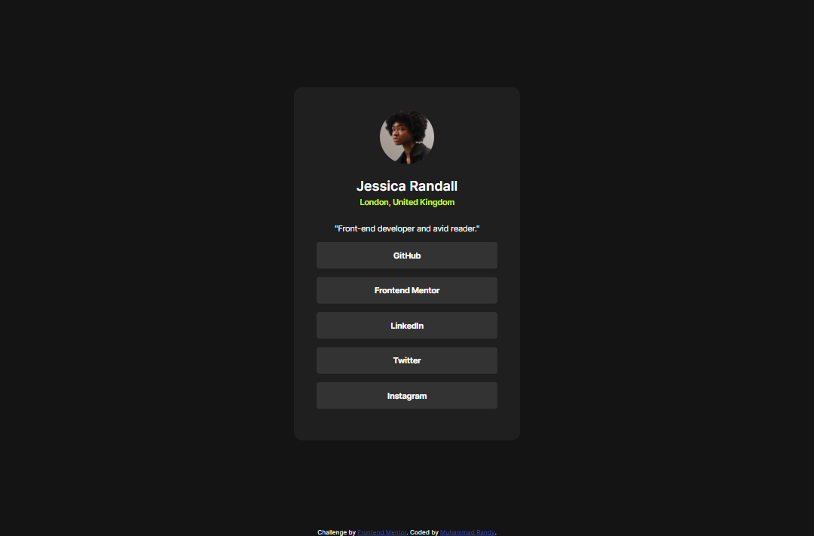
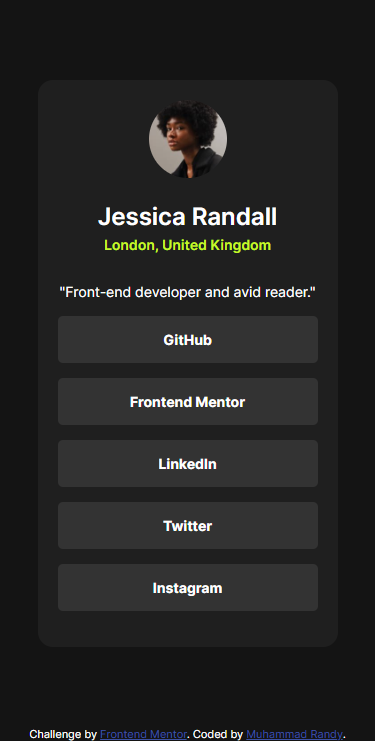
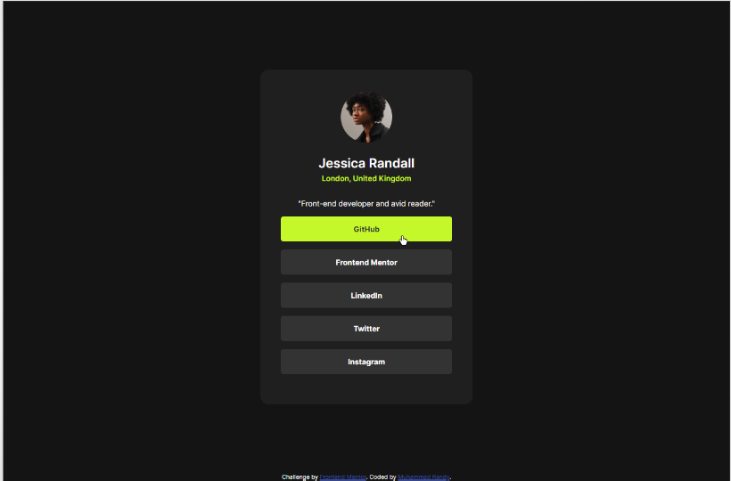

# Frontend Mentor - Social links profile solution

This is a solution to the [Social links profile challenge on Frontend Mentor](https://www.frontendmentor.io/challenges/social-links-profile-UG32l9m6dQ). Frontend Mentor challenges help you improve your coding skills by building realistic projects.

## Table of contents

- [Overview](#overview)
  - [The challenge](#the-challenge)
  - [Screenshot](#screenshot)
  - [Links](#links)
- [My process](#my-process)
  - [Built with](#built-with)
  - [What I learned](#what-i-learned)
  - [Useful resources](#useful-resources)
- [Author](#author)

## Overview

### The challenge

Users should be able to:

- See hover and focus states for all interactive elements on the page

### Screenshot

#### Desktop Preview



#### Mobile Preview



#### Hover Preview



### Links

- Solution URL: [Github](https://github.com/MuhRandy/social-links-profile-main-frontendmentor)
- Live Site URL: [Github Pages](https://muhrandy.github.io/social-links-profile-main-frontendmentor/)

## My process

### Built with

- Semantic HTML5 markup
- CSS custom properties
- Flexbox
- Responsive

### What I learned

When I put `<a>` tag on `<li>` I am wondering why when I hover on `<li>`, it text color not change. I already write I on `<li>` like this:

```css
:root {
  /* Primary */
  --green: hsl(75, 94%, 57%);

  /* Neutral */
  --white: hsl(0, 0%, 100%);
  --grey: hsl(0, 0%, 20%);
  --dark-grey: hsl(0, 0%, 12%);
  --off-black: hsl(0, 0%, 8%);
}

li {
  list-style: none;

  background-color: var(--grey);
  border-radius: 5px;
  padding: 15px;
  cursor: pointer;
}

li:hover {
  background-color: var(--green);
  color: var(--grey);
}
```

The background did change, but not the text. So I change the css again to be like this:

```css
:root {
  /* Primary */
  --green: hsl(75, 94%, 57%);

  /* Neutral */
  --white: hsl(0, 0%, 100%);
  --grey: hsl(0, 0%, 20%);
  --dark-grey: hsl(0, 0%, 12%);
  --off-black: hsl(0, 0%, 8%);
}

li {
  list-style: none;

  background-color: var(--grey);
  border-radius: 5px;
  padding: 15px;
  cursor: pointer;
}

li a {
  text-decoration: none;
}

li:hover {
  background-color: var(--green);
}

li a:hover {
  color: var(--grey);
}
```

And the text still not change until you hovering it directly. I don't want that, what I want is when I hovering on `<li>` the background and the text will change. So I have an idea to make the just the `<a>` element that change when hovering and I will make it covering the whole `<li>` and I write this on css:

```css
:root {
  /* Primary */
  --green: hsl(75, 94%, 57%);

  /* Neutral */
  --white: hsl(0, 0%, 100%);
  --grey: hsl(0, 0%, 20%);
  --dark-grey: hsl(0, 0%, 12%);
  --off-black: hsl(0, 0%, 8%);
}

li {
  list-style: none;

  background-color: var(--grey);
  border-radius: 5px;
  padding: 0;
  cursor: pointer;
}

li a {
  border-radius: 5px;
  text-decoration: none;
  padding: 15px;
  width: 100%;
  height: 100%;
}

li a:hover {
  background-color: var(--green);
  color: var(--grey);
}
```

And I wondering why this doesn't work. Turn out the `<a>` is inline element, so I can't change the size of the element (width and height). When I make the display to be block. It work the way I want it. This is what I write in the end:

```css
:root {
  /* Primary */
  --green: hsl(75, 94%, 57%);

  /* Neutral */
  --white: hsl(0, 0%, 100%);
  --grey: hsl(0, 0%, 20%);
  --dark-grey: hsl(0, 0%, 12%);
  --off-black: hsl(0, 0%, 8%);
}

li {
  list-style: none;

  background-color: var(--grey);
  border-radius: 5px;
  padding: 0;
  cursor: pointer;
}

li a {
  border-radius: 5px;
  text-decoration: none;
  padding: 15px;
  display: block;
  width: 100%;
  height: 100%;
}

li a:hover {
  background-color: var(--green);
  color: var(--grey);
}
```

### Useful resources

- [W3School](https://www.w3schools.com/) - This helped me for almost anything, just like the documentation of HTML, CSS, and javascript.
- [Stack Overflow](https://stackoverflow.com/) - This is an amazing forum where you can ask or find someone with similiar problem you have that already solved.

## Author

- Website - [Muhammad Randy](https://mrandy-portfolio.web.app/)
- Frontend Mentor - [@MuhRandy](https://www.frontendmentor.io/profile/MuhRandy)
- Twitter - [@RandyThz](https://twitter.com/RandyThz)
